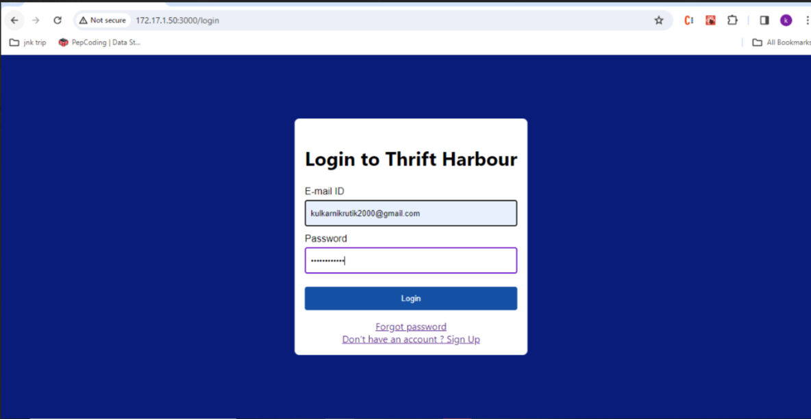
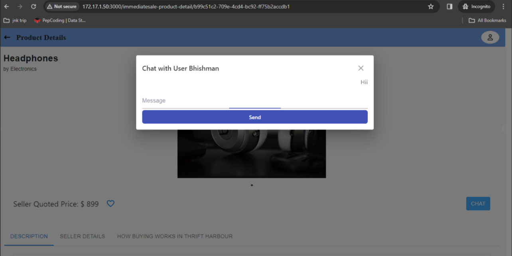
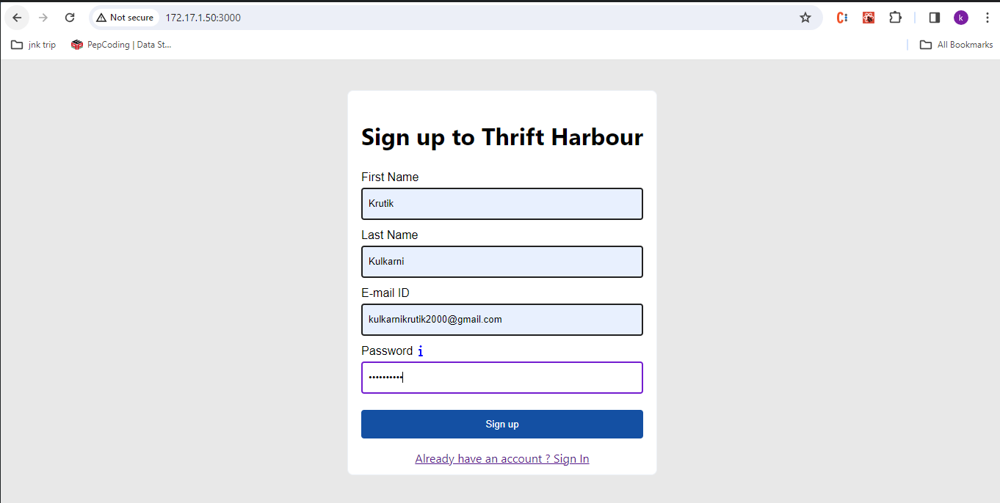
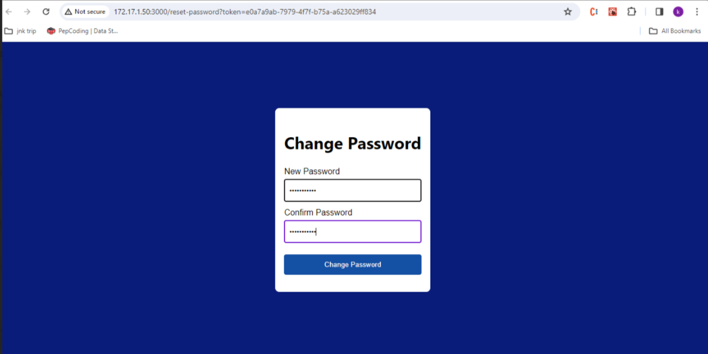
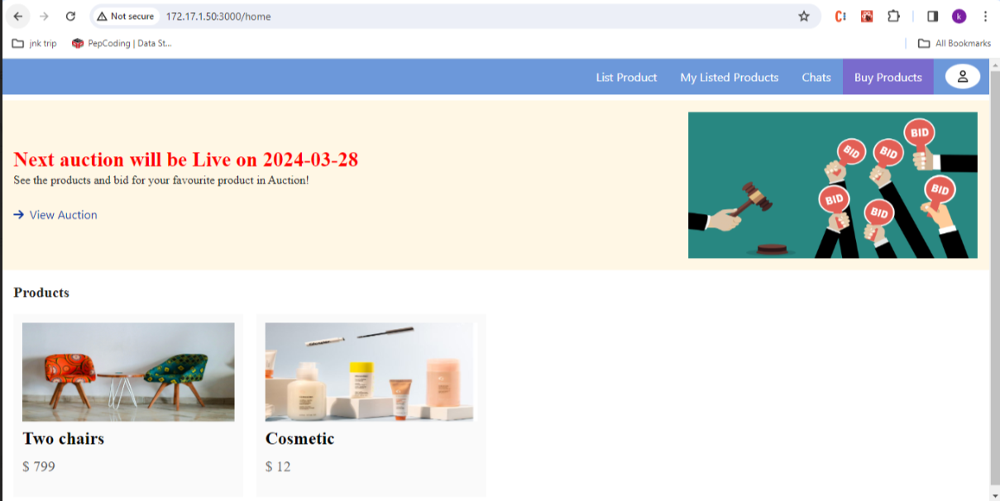
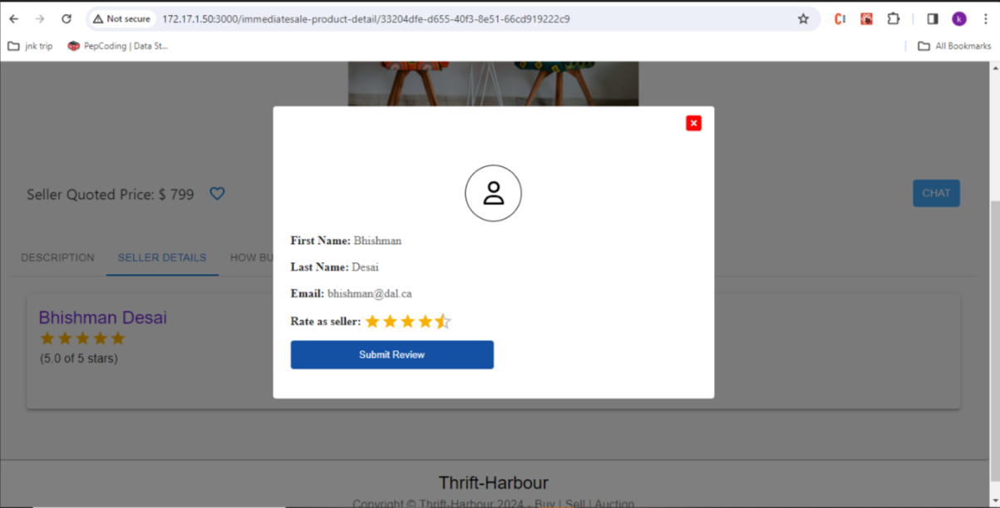
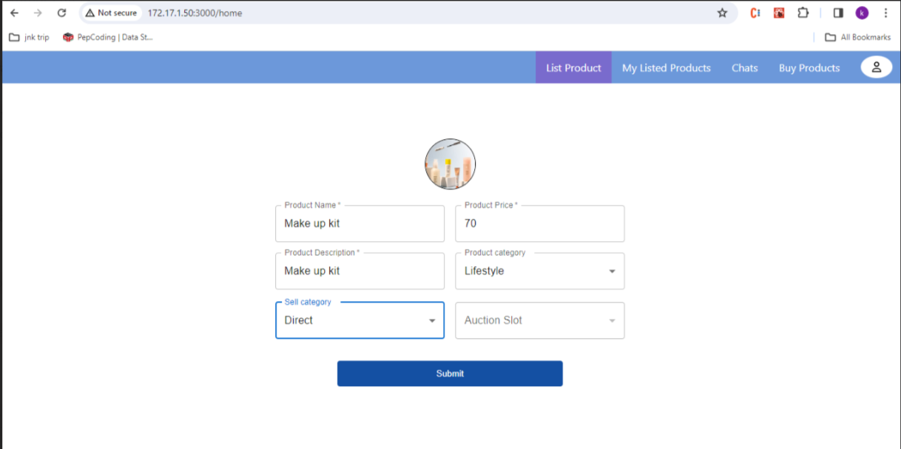
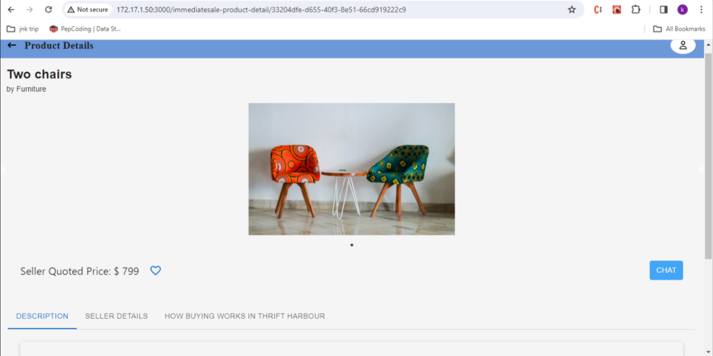
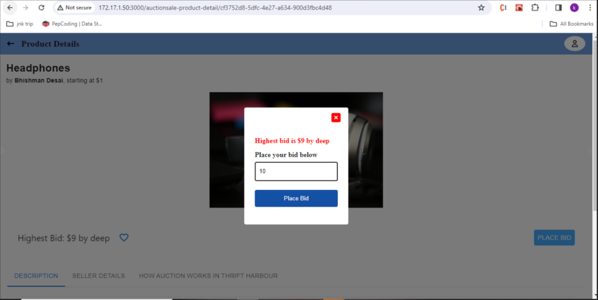
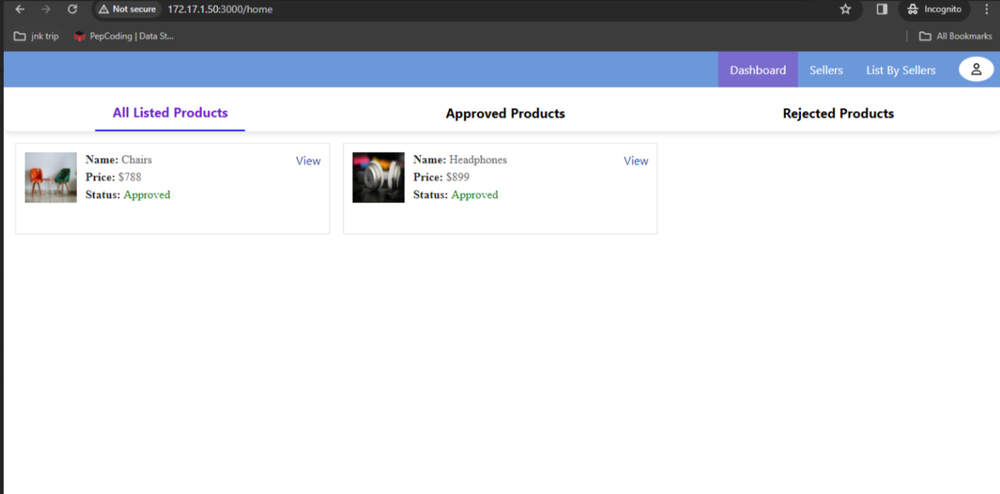

# THRIFT HARBOUR Project Overview

This file outlines the Technologies, Prerequisites, Dependencies, Build and Deploy Instruction, User Scenarios for the Thrift Harbour project.


## **Technologies**
<hr>

* Backend: Spring Boot (Java)
* Frontend: React.js
* Database: MySql

## **Prerequisites**
<hr>

* **Java Development Kit (JDK):** You will need Java 17 installed on your system to compile and run Java code. You can download 
the latest version from the official Oracle website: Java SE Downloads: https://www.oracle.com/java/technologies/javase-downloads.html.
* **Maven:** Maven is a project management and build automation tool widely used for Java projects. Download and install Maven from the official 
Apache website: Apache Maven: https://maven.apache.org/.
* **Verifying Installations:** Open a terminal window and type java -version. This should display Java 17 (or higher) as the installed version.
Similarly, type mvn -v to check the installed Maven version.


## **Dependencies**
<hr>

### **Backend :**

This project relies on various external libraries defined within the pom.xml file. These dependencies are automatically downloaded and managed 
by Maven during the build process.

* **Spring Boot Starter Dependencies:**
    * spring-boot-starter-data-jpa: Provides support for JPA (Java Persistence API) and database access.
    * spring-boot-starter-web: Enables creation of web applications. 
    * spring-boot-starter-security: Provides security features for the application. 
    * spring-boot-starter-validation: Provides data validation features. 
    * spring-boot-starter-mail: Enables sending emails from the application. 
    * spring-boot-starter-websocket: Enables WebSocket communication for the application.

* **Database Driver:**
    * mysql-connector-j: Enables connection to MySQL databases.

* **Project Lombok:**
  * lombok: Provides code simplification annotations (requires additional configuration).

* **JWT (JSON Web Token):**
    * jjwt-api, jjwt-impl, jjwt-jackson: Libraries for handling JSON Web Tokens for authentication.

* **MapStruct:**
    * mapstruct: Simplifies object mapping between different representations.

* **Passay:**
    * passay: Provides password strength validation library.

* **AWS S3 SDK:**
    * s3: Enables interaction with Amazon S3 storage service.

* **Springdoc OpenApi:**
    * springdoc-openapi-starter-webmvc-ui: Provides OpenAPI documentation and UI for the application.

* **Testing:**
    * junit: JUnit testing framework for unit tests.

**Installation**

* Navigate to Project Directory:
    * Open a terminal window and navigate to the root directory of your project where the pom.xml file resides.
* Build the Project:
    * Run the following command in the terminal: ```mvn clean install```
* This command performs following actions:
  * ```clean```: Deletes any previously built artifacts.
  * ```install```: Compiles the project source code, packages it into a JAR file, and installs it (along with its dependencies) into your local Maven repository.
  

### **Frontend :**

This section outlines the various dependencies utilized within the front end, including libraries, frameworks, 
and tools necessary for development and functionality. The package.json file provides a comprehensive list of 
these dependencies along with their respective versions.

* @emotion/react: A library for styling React components using Emotion CSS-in-JS.
* @emotion/styled: A styled-components API compatible library for Emotion CSS-in-JS.
* @material-ui/core: React components library that implements Google's Material Design.
* @material-ui/icons: Provides access to the icons of the Material-UI library.
* @mui/icons-material: Icon components for Material-UI.
* @mui/joy: Library for Joyful Material UI designs.
* @mui/lab: Experimental components and lab features for Material-UI.
* @mui/material: React components library implementing Material Design in the MUI framework.
* @testing-library/jest-dom: Custom Jest matchers to test the state of the DOM.
* @testing-library/react: Testing utilities for React components.
* @testing-library/user-event: Utilities for testing user interactions.
* @types/jest: TypeScript type definitions for Jest.
* @types/node: TypeScript type definitions for Node.js.
* @types/react: TypeScript type definitions for React.
* @types/react-dom: TypeScript type definitions for ReactDOM.
* @types/react-slick: TypeScript type definitions for React Slick.
* axios: Promise-based HTTP client for the browser and Node.js.
* bootstrap: Front-end framework for developing responsive and mobile-first websites.
* net: A Node.js module for network communication.
* prettier: Opinionated code formatter.
* react: JavaScript library for building user interfaces.
* react-bootstrap: Bootstrap components built with React.
* react-dom: Entry point to the DOM and server renderers for React.
* react-router-dom: DOM bindings for React Router.
* react-scripts: Configuration and scripts for Create React App.
* react-slick: React carousel component built with Slick.
* react-spinners: Loading spinner components for React.
* react-stomp: WebSocket library for React.
* slick-carousel: jQuery carousel plugin.
* sockjs: WebSocket emulation - SockJS-client library.
* sockjs-client: WebSocket client library.
* styled-components: Library for styling React components with tagged template literals.
* typescript: A superset of JavaScript that adds optional static typing.

**Installation**

* To install Node.js run the following commands:<br>
  * ```sudo apt-get update  sudo apt-get install nodejs```<br>
  * ```sudo apt-get update  sudo apt-get install nodejs```

* After installation, verify Node.js and are installed by running:<br>
  * ```node -v ```
  * ```npm -v```

* To install the external dependencies, run the following command. Please see before running this command that you are 
located in the thrift-harbour folder under the frontend directory:
  * ```npm install```
  
* Running and Building the application 
  * To run the application, use:
    * ```npm run start```
  * To build the application, use:
    * ```npm run build```


## **Build and Deploy Instruction**
<hr>

### **Frontend :**

**Overview:**
* This section outlines the steps to build and deploy the Thrift Harbour Frontend application using GitLab CI/CD. 
The provided YAML file defines the necessary stages, jobs, and scripts for the process.

**Prerequisites:**
* Docker installed on your CI/CD runner.
* SSH access to the deployment server.
* A GitLab repository containing your frontend code.

**GitLab CI/CD Configuration (.gitlab-ci.yml):**
* The .gitlab-ci.yml file defines two stages: publish and deploy. Each stage has corresponding jobs:

1.  publish-fe (Stage: publish):
    * Image: docker:latest
    * Tags: deployment-group-15
      * Variables:
        * DOCKER_TLS_CERTDIR: “”
        * DOCKER_HOST: “tcp://docker:2375”
    * Services: docker:dind
      * Script:
        * Navigate to the frontend directory: cd frontend/thrift-harbour
        * Print the working directory: pwd
        * Echo the value of $SERVER_IP
        * Display Docker version: docker --version
        * Log in to Docker Hub: docker login -u $DOCKER_HUB_USER -p $DOCKER_HUB_PWD docker.io
        * Build the Docker image: docker build -t docker.io/group15/frontend:$CI_COMMIT_SHORT_SHA .
        * Push the image to Docker Hub: docker push docker.io/group15/frontend:$CI_COMMIT_SHORT_SHA
    * Only run on: main branch merge

2. deploy-fe (Stage: deploy):
   * Image: alpine:latest
   * Tags: deployment-group-15
     * Script:
       * Set appropriate permissions for the SSH key: chmod og= $ID_RSA
       * Install OpenSSH client: apk update && apk add openssh-client
         * SSH into the deployment server:
         * Pull the Docker image: docker pull docker.io/group15/frontend:$CI_COMMIT_SHORT_SHA
         * Remove any existing container: docker container rm -f thrift-harbour-frontend-app || true
         * Run a new container: docker run -d -p 3000:3000 --name thrift-harbour-frontend-app docker.io/group15/frontend:$CI_COMMIT_SHORT_SHA
     * Environment:
       * Name: production
       * URL: http://172.17.1.50:3000
   * Only run on: main branch merge

### **Backend :**

**Overview:**
* This section outlines the steps to build and deploy the Thrift Harbour Backend application using GitLab CI/CD.
  The provided YAML file defines the necessary stages, jobs, and scripts for the process.

**Prerequisites:**
* Docker installed on your CI/CD runner.
* SSH access to the deployment server.
* A GitLab repository containing your frontend code.

**GitLab CI/CD Configuration (.gitlab-ci.yml):**

1. Build Backend Services:
   * In this step, we compile and package the backend services of the application.
   * We've used Maven, for this project.
   * The ```mvn clean package``` command cleans the project (removing any existing build artifacts) and then builds the project, creating an executable JAR file.
   * The resulting JAR file contains the compiled code and any necessary dependencies.
   
2. Run Tests:
   * We execute tests using Maven ```mvn test```.
   * These tests cover unit tests and integration tests.
   * If all tests pass, we can be confident that the application behaves as expected.
   
3. Quality Checks:
   * Quality checks help maintain code quality and identify potential smells.
   * We use DesigniteJava, to analyze the codebase.
   * The tool detects code smells, design flaws, and other issues.
   * The results are stored in a directory called “smells.”

4. Publish Docker Image:
   * Docker allows us to package the application and its dependencies into a container.
   * We build a Docker image containing the backend application.
   * The image is tagged with a unique identifier (usually the Git commit SHA).
   * We push the image to Docker Hub.
   * Only run on: main branch merge
   
5. Deploy to Production:
   * Deployment involves moving the application to a production environment.
   * We use SSH to connect to the production server.
   * Steps include:
     * Setting appropriate permissions for SSH keys.
     * Pulling the Docker image from Docker Hub.
     * Removing any existing containers (if present). 
     * Running a new container with the updated image.
   * Only run on: main branch merge


## **User Scenarios**
<hr>

Thrift Harbour has two primary user roles: Admin and User. Here, User role has two subcategories Buyer and Seller. 
User can be both Buyer as well Seller at any particular time.

Below, the typical user scenarios are outlined for each role, including the unique case where a user functions 
as both a Seller and a Buyer. Both users share common login and chat functionalities, ensuring a seamless and 
secure experience across the platform.

### **Common Functionalities for Both Users**
<hr>

#### Login

Users would be able to log in to the Thrift Harbour account using their registered Email-Id and Password.

<p align="center">
  
</p>

#### Chat

Admin would be able to chat with Sellers for any clarification regarding their listings through 
provided chat button next to the Seller information on the dashboard.<br>
Buyers would be able to chat with Seller through the chat button provided on the product page.<br>
Seller would be able to chat with all Buyers who messaged him/her regarding the particular product 
on the product page. Also list of chats would be provided on product page.

<p align="center">
  
</p>

### **Buyer and Seller User Scenarios**
<hr>

#### Registration

User would be able to create a Thrift Harbour account, so that I would be able to sign up on the platform. 
Required fields for registration: First Name (One word), Last name (One word), E-mail ID, Password 
(Password policy: Combination of alphanumeric characters with a limit of at least 8 characters)

<p align="center">
  
</p>

#### Forgot Password

As a registered Users, they would be able to change their password if they forget it due to any reason, 
so that they would be able to Login in the platform. User needs to provide registered email id for it and 
after requesting they would get an email from Thrift Harbour which contains the url for the reset password page.
On this page user needs to enter new password with confirm password and submit it.

<p align="center">
  
</p>

#### Landing Page

As a User, on the initial page a banner would be always appear on the top of the main landing page informing about 
the next auction date and time. Once the auction is live, the button for joining the auction will appear on the landing page.

<p align="center">
  
</p>

#### Ratings and Reviews

User would be able to rate other user for the Buyer and Seller as well. This ratings would be displayed
to user profile. When User visits another User's profile, he/she would have the provision to give ratings.

<p align="center">
  
</p>

### **Seller User Scenarios**
<hr>

#### Product Listing

As a logged-in users, sellers would be able to apply for product listing, so that they would 
be able to put their products up for selling on the platform. Required fields for the listing:
Product name, Product Description, Product image, Product price, Product Category, Sell category (Auction or Direct),
Auction slot (Only available if the auction is selected). When seller will submit the listing 
they will be applying to review their listing.

Sellers also would be able to see the listed products. There would be two different sections one is
for Immediate Sale and other is for Auction Sale. Here, the review status (Pending, Approved, Rejected)
would be displayed for each product.

<p align="center">
  
</p>

### **Buyer User Scenarios**
<hr>

#### Immediate Sale Item Selling

As a Buyer, users would be redirected to this page when they click on a listing they would like to purchase 
from the Immediate Item Listing Page. Product details would be displayed on this page with chat button and 
add to favourite button. Seller information section also be provided here.

<p align="center">
  
</p>

#### Auction Sale Item Selling and Bidding

As a Buyer, users would be redirected to this page when they click on a listing they would like to bid from 
the Auction Listing Page. Product details and Seller information would be displayed with starting bid, highest bid of the item.
User would also be able to place a bid on this item.

<p align="center">
  
</p>

### **Admin Scenarios**
<hr>

After Login, Admin would be redirected to the dashboard. On the dashboard, Admin would be able to view all the products which are 
listed in the platform along with the approval status. The approval status could be "APPROVED","DENIED" and "PENDING".
Admin would be able to see product in details and approve/reject product and also can provide reason for denying. Admin would be able to see all Sellers who listed the products. Also, they would be able to see all approved and denied Immediate 
and Auction Sale listing.

<p align="center">
  
</p>